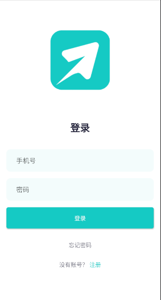
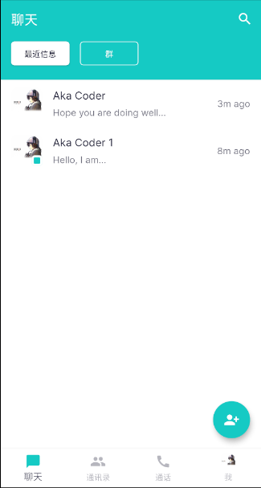
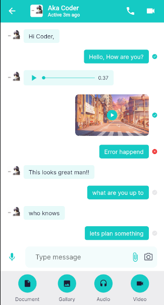
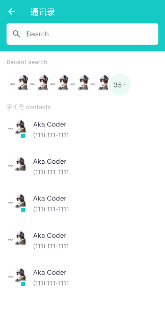
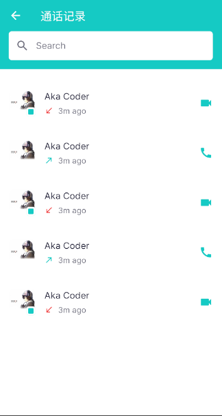
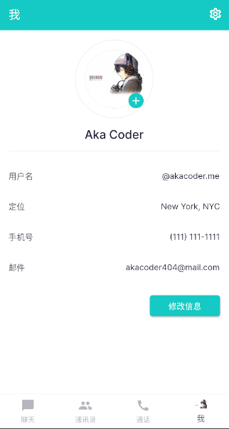
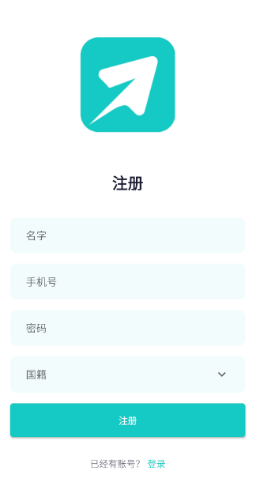
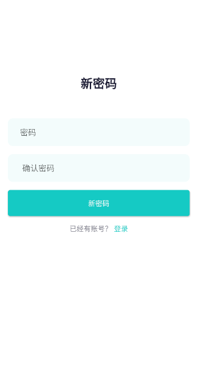
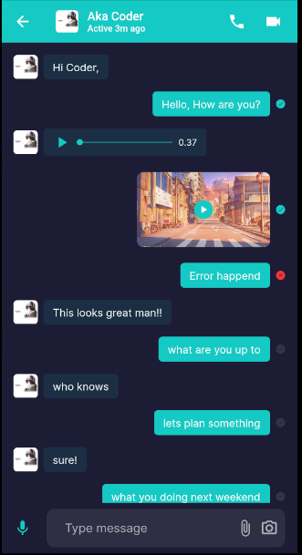

# Chatter App

basic chat / messaging app using flutter 

# goals
a fun project where I could become more familiar with flutter bc it is cool

# designs and interfaces

Version 1 - basic development of pages, including login screen, signup screen, chat screen, contacts screen, voice and video call messages, profile page, and edit profile page, and simple chat interface, has dark mode 

| sign in                                                      | chat screen                                                  | message screen                                               |
| ------------------------------------------------------------ | ------------------------------------------------------------ | ------------------------------------------------------------ |
|  |  |  |
| contacts                                                     | call history                                                 | profile page                                                 |
|  |  |  |
| signup                                                       | forgot password                                              | dark mode messag                                             |
|  |  |  |

